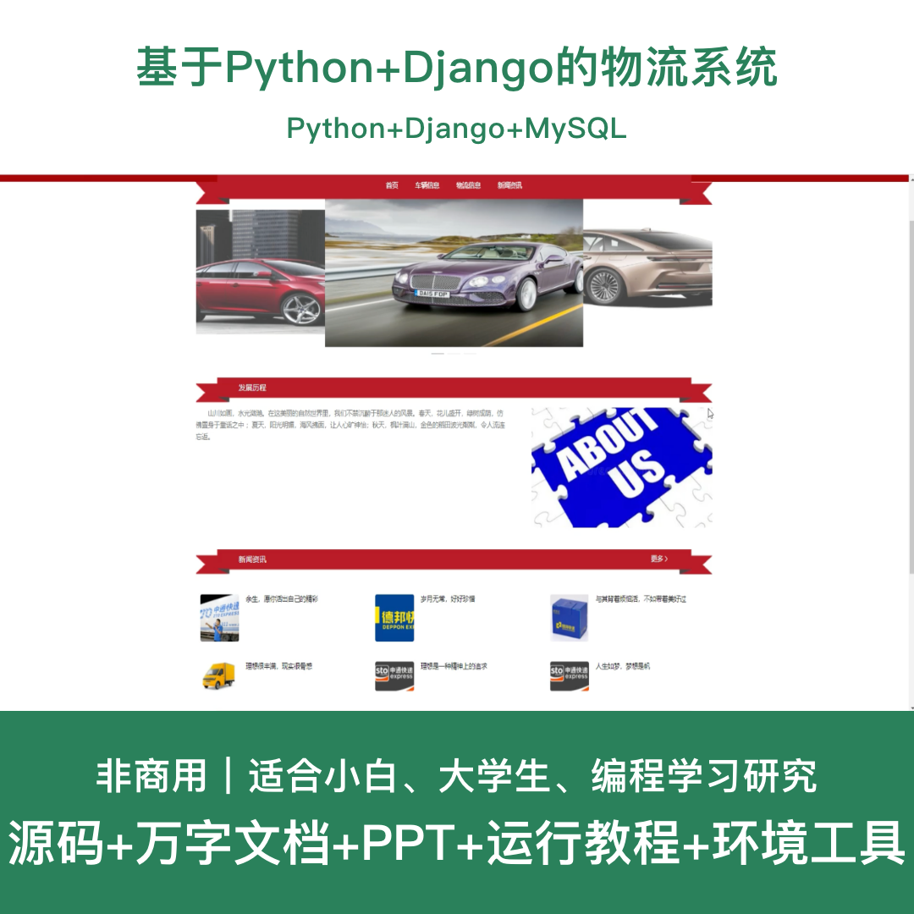
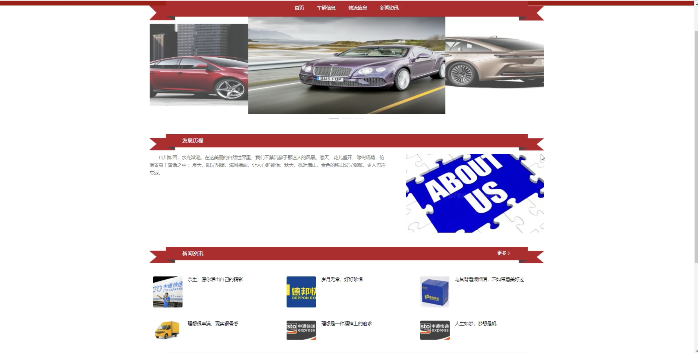
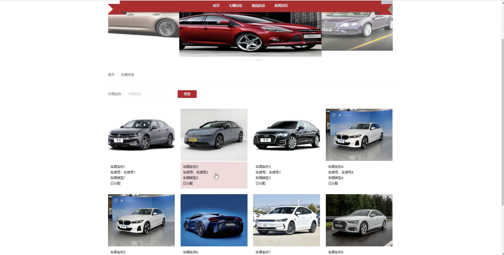
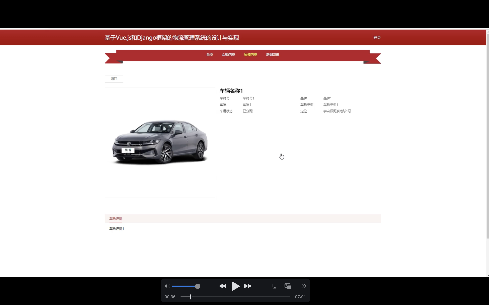
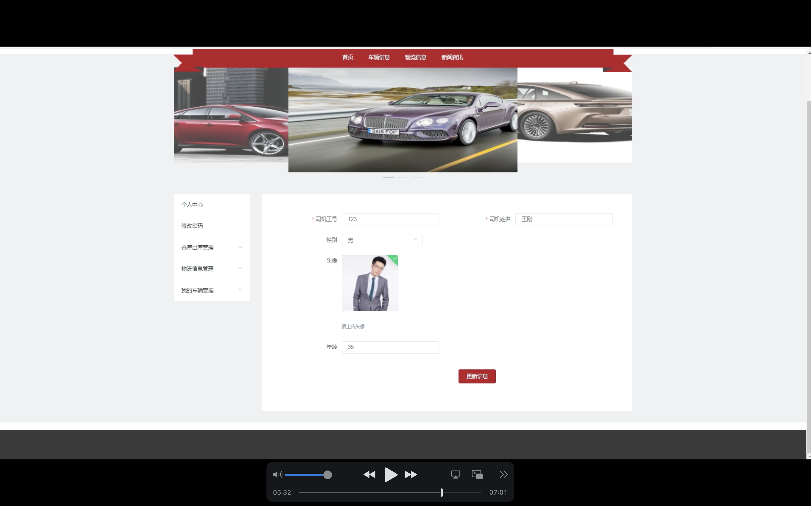
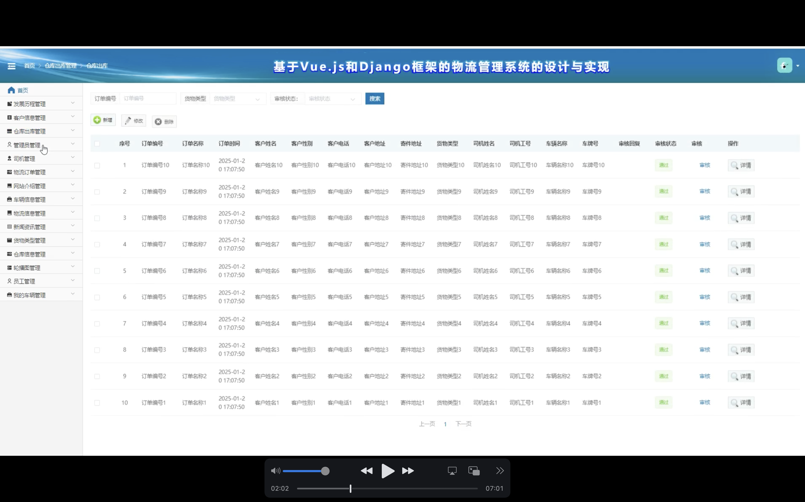
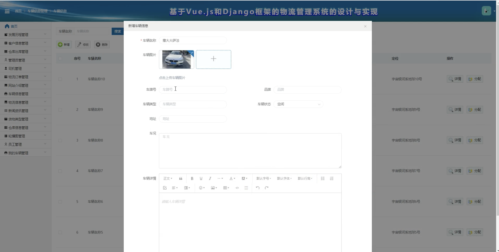
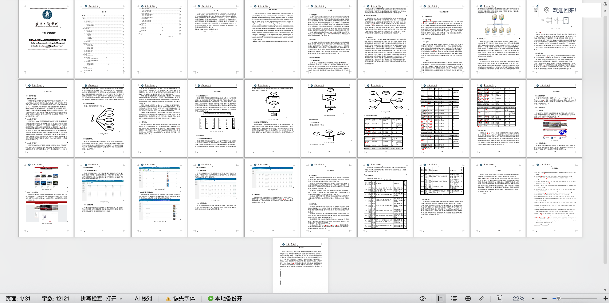

# python125D
python125D基于Python+Django的物流管理系统+LW+PPT
 
## 源码问题查看主页咨询

### 一、关键词
物流管理系统、物流系统、货运系统、配送系统、仓储系统

### 二、作品包含
源码+数据库+万字设计文档+PPT+全套环境和工具资源+本地部署教程

### 三、项目技术
前端技术：Html、Css、Js、Vue、Element-ui、Axios

后端技术：Python、Django2.0、PyMySQL

### 四、运行环境（以下版本亲测，其他版本兼容性请自行测试）
开发工具：PyCharm + VSCODE

数据库：MySQL 5.7+

数据库管理工具：Navicat10以上版本

环境配置软件：Python3.7+

浏览器：谷歌浏览器

### 五、项目介绍
项目编号：python125D

基于Python+Django的物流管理系统，实现物流信息化管理，提升物流企业的运营效率和服务质量。

角色：管理员、司机、员工

管理员功能：登录、仓库信息管理、仓库出库管理、车辆信息管理、车辆分配管理、货物类型管理、客户信息管理、司机管理、员工管理、物流订单管理、物流信息管理。

司机功能：登录、查看车辆分配、查看物流订单、更新物流状态。

员工功能：登录、仓库出库管理、物流订单管理、客户信息管理。

数据库表：16张

### 六、运行截图

